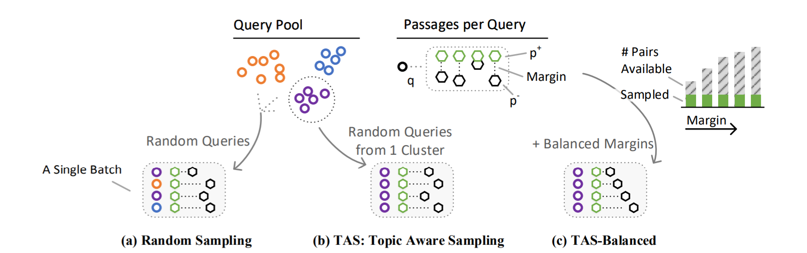
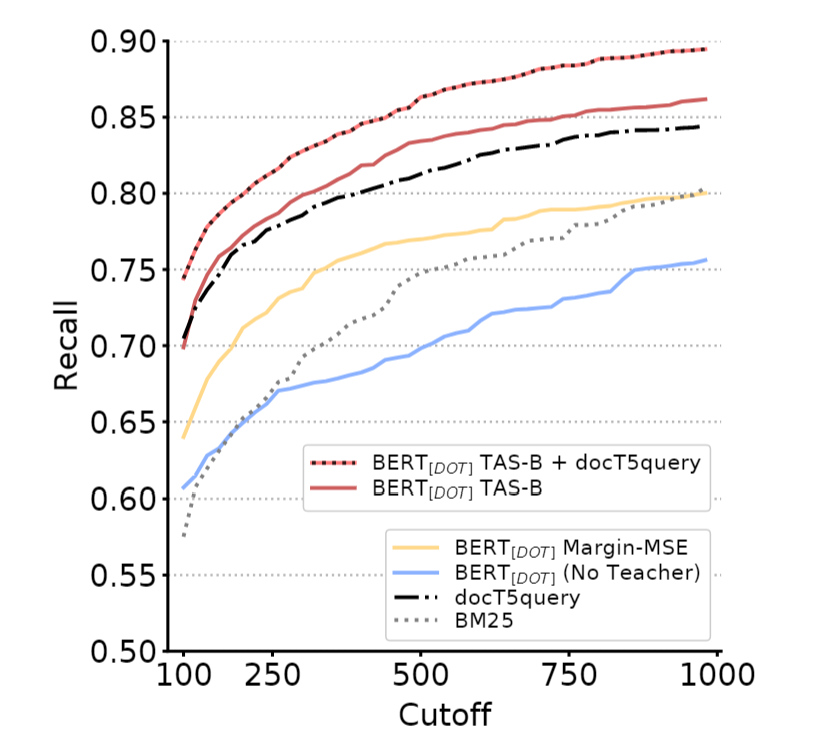

# Training Dense Retrieval with Balanced Topic Aware Sampling (TAS-Balanced)

Welcome 🙌 to the repository of our paper:

*Efficiently Teaching an Effective Dense Retriever with Balanced Topic Aware Sampling*  Sebastian Hofstätter, Sheng-Chieh Lin, Jheng-Hong Yang, Jimmy Lin, Allan Hanbury

https://arxiv.org/abs/2104.06967

**tl;dr** We compose training batches with queries from the same cluster (so that they are topically related) and balance the margin of the pairwise negative sampled passage: TAS-B. This is a zero-cost method, as it only requires a very fast query clustering once before training. We train our dense retriever (BERT<sub>DOT</sub>) with a dual supervison from BERT<sub>CAT</sub> models for pairwise signals and a ColBERT model for in-batch-negatives signals (that are now topically related). With this method we are able to train a very effective dense retrieval model on a single consumer grade GPU and batch size as low as 32. 

If you have any questions, suggestions, or want to collaborate please don't hesitate to get in contact with us via [Twitter](https://twitter.com/s_hofstaetter) or mail to s.hofstaetter@tuwien.ac.at


*The high-level overview of the TAS-Balanced batch composition, and difference to random sampling*

**Please cite our work as:**
````
@inproceedings{Hofstaetter2021_tasb_dense_retrieval,
 author = {Sebastian Hofst{\"a}tter and Sheng-Chieh Lin and Jheng-Hong Yang and Jimmy Lin and Allan Hanbury},
 title = {{Efficiently Teaching an Effective Dense Retriever with Balanced Topic Aware Sampling}},
 booktitle = {Proc. of SIGIR},
 year = {2021},
}
````
## Pre-Trained Models

We provide the following full-trained 6 layer DistilBERT-based models (trained with our TAS-Balanced and dual supervision method) via the HuggingFace model hub:

* **TAS-B DistilBERT<sub>DOT</sub>** (re-ranking and dense-retrieval model): https://huggingface.co/sebastian-hofstaetter/distilbert-dot-tas_b-b256-msmarco

    This is the instance from the paper trained with a batch size of 256.
    The DistilBERT architecture should work as plug 'n play everywhere you use the transformer library. For a minimal usage example of the BERT<sub>DOT</sub> model check out our notebook [minimal_bert_dot_usage_example.ipynb](minimal_bert_dot_usage_example.ipynb) here or [](https://colab.research.google.com/github/sebastian-hofstaetter/tas-balanced-dense-retrieval/blob/master/minimal_bert_dot_usage_example.ipynb)

## Source Code

The full source-code for our paper is here, as part of our matchmaker library: https://github.com/sebastian-hofstaetter/matchmaker

We have getting started guides for training teachers & students, as well as a range of other possibilities for dense retrieval training.

## Efficiently Teaching an Effective Dense Retriever with Balanced Topic Aware Sampling

A vital step towards the widespread adoption of neural retrieval models is their resource efficiency throughout the training, indexing and query workflows. The neural IR community made great advancements in training effective dual-encoder dense retrieval (DR) models recently. A dense text retrieval model uses a single vector representation per query and passage to score a match, which enables low-latency first stage retrieval with a nearest neighbor search. Increasingly common, training approaches require enormous compute power, as they either conduct negative passage sampling out of a continuously updating refreshing index or require very large batch sizes for in-batch negative sampling. Instead of relying on more compute capability, we introduce an efficient topic-aware query and balanced margin sampling technique, called TAS-Balanced. We cluster queries once before training and sample queries out of a cluster per batch. We train our lightweight 6-layer DR model with a novel dual-teacher supervision that combines pairwise and in-batch negative teachers. Our method is trainable on a single consumer-grade GPU in under 48 hours (as opposed to a common configuration of 8x V100s). We show that our TAS-Balanced training method achieves state-of-the-art low-latency (64ms per query) results on two TREC Deep Learning Track query sets. Evaluated on NDCG@10, we outperform BM25 by 44%, a plainly trained DR by 19%, docT5query by 11%, and the previous best DR model by 5%. Additionally, TAS-Balanced produces the first dense retriever that outperforms every other method on recall at any cutoff on TREC-DL and allows more resource intensive re-ranking models to operate on fewer passages to improve results further.

### Recall Improvements on TREC-DL

One result we want to highlight here (more are in the paper) is the recall improvement of TAS-B on the densely judged TREC-DL 2020 query set. Alone it outperforms both BM25 and docT5query, our baseline dense retrievers, even with pairwise Margin-MSE don't show consistent improvements. When we fuse the dense TAS-B and sparse docT5query scores (retaining the same <70ms latency) we get another considerable recall boost for all cutoff points. Now, if we want to apply another costly re-ranking stage on top, we can do so at a lower cutoff, reducing our overall pipeline latency. 


*Recall at different cutoffs on TREC-DL 2020*
